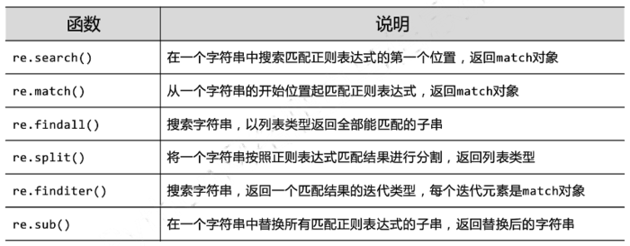
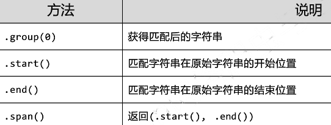

# Python中的正则表达式
实际编程开发中，会遇到很多字符串处理相关的工作，因此专为处理匹配字符串的正则表达式一定需要花时间学习的。

## 基础表达
我们以匹配一个简单的邮箱*liangzelang@gmail.com*为例介绍正则表达式的入门方法。

### 基本元素表达
* `\w`表示匹配一个字母或数字
* `\d`表示匹配一个数字
* `\s`表示匹配一个空格
* `.`表示匹配任意字符

### 基本数量表达

有了上述的基本表达，那么我们可以看一下如果匹配不同数量的字符
* `+`表示一个或以上的字符，如`\d+`表示匹配一个或以上的数字字符串，可以匹配`1`和`123456`
* `*`表示任意个字符，可以是0个，如`\w*`表示匹配任何个字母或数字
* `?`表示0个或1个字符，如`<?liangzelang>?`表示匹配`liangzelang` 或 `<liangzelang>`
* `{n}`表示n个字符，同时可以限定数量范围`{m,n}`,表示m--n个字符

### 特殊字符表达
* `\`转义符，实际工作中会用到很多特殊字符`* . ? + $ ^ [ ] ( ) { } | \ /`等，这个时候需要加上`\`转义符

了解了上面的基本表达可以顺利写出邮箱的正则表达式：
`\w+@\w+\.\w+` ,为了更直观python的用例如下：

## 进阶表达
匹配`192.168.1.1`这个IP地址，可以容易得到`\d+\.\d+\.\d+\.\d+`,但是这样有个问题就是如果是`999.999.999.999`也匹配上了,因此我们需要匹配的更加准确

### 精确范围表达
* `[]`表示匹配的字符串范围，如`[0-9A-Za-z]`表示一个数字或者字母
* `^`表示匹配字符串起始
* `$`表示匹配字符串结尾
* `[A|B]`表示匹配A或者B
那么正则表达式`'^[2[0-5][0-5]|1[0-9][0-9]|[0-9]?[0-9][\.]?]{4}$'` 可以匹配`192.168.1.1`

## python re库
以上就是在python中使用正则表达式的基础知识，python中有专门的正则表达式库`re`,该库主要包含一些处理正则表达式的函数接口：


### 匹配正则表达式 re.match
以上文讲到的匹配email地址：
```python
import re

if re.match(r'\w+@\w+\.\w+', 'liangzelang@gmail.com'):
    print("OK")
else:
    print("not match")

```

匹配IP地址：
```python
import re

if re.match(r'^[2[0-5][0-5]|1[0-9][0-9]|[0-9]?[0-9][\.]?]{4}$', '192.168.1.1'):
    print("IP ok")
else:
    print("IP not match")

```

### 切分字符 re.split
如果使用正常的字符串切分函数是无法去除多余的字符或者空格的：
```python
>>> 'a b  c'.split(' ')
['a', 'b', '', 'c']
```
使用re.split函数：
```python
>>> import re
>>> re.split(r'\s+', 'a b  c')
['a', 'b', 'c']
```

### 分组
上文中我们匹配了邮箱和IP，那如果我们要找到邮箱中对应的用户名、邮箱服务商或者IP地址的网段，那么就需要把匹配到的字符串分组；
* `()`表示需要提取的分组

re.match函数返回的Match对象正好有group方法可以提供匹配到每个分组字符串。

```python
>>> import re
>>> m = re.match(r'^(\w+)@(\w+)\.(\w+)$', 'liangzelang@gmail.com')
>>> m
<re.Match object; span=(0, 21), match='liangzelang@gmail.com'>
>>> m.group(0)
'liangzelang@gmail.com'
>>> m.group(1)
'liangzelang'
>>> m.group(2)
'gmail'
>>> m.group(3)
'com'

```

### 编译 re.compile
实际使用中一般先编译正则表达式，可以确保正则表达式本身没有语法错误，然后再使用编译后的正则表达式直接匹配使用。如果反复使用效率会有较大提升。
```python
>>> re.compile(r'^(\w+)@(\w+)\.(\w+)$')
re.compile('^(\\w+)@(\\w+)\\.(\\w+)$')
>>> email = re.compile(r'^(\w+)@(\w+)\.(\w+)$')
>>> email.match('liangzelang@gmail.com').groups()
('liangzelang', 'gmail', 'com')

```

## 参考
* [正则表达式](https://www.liaoxuefeng.com/wiki/1016959663602400/1017639890281664)
* [re库的用法介绍
](https://www.jianshu.com/p/0053af01554e)


# Linux正则表达式
* 未完待续


